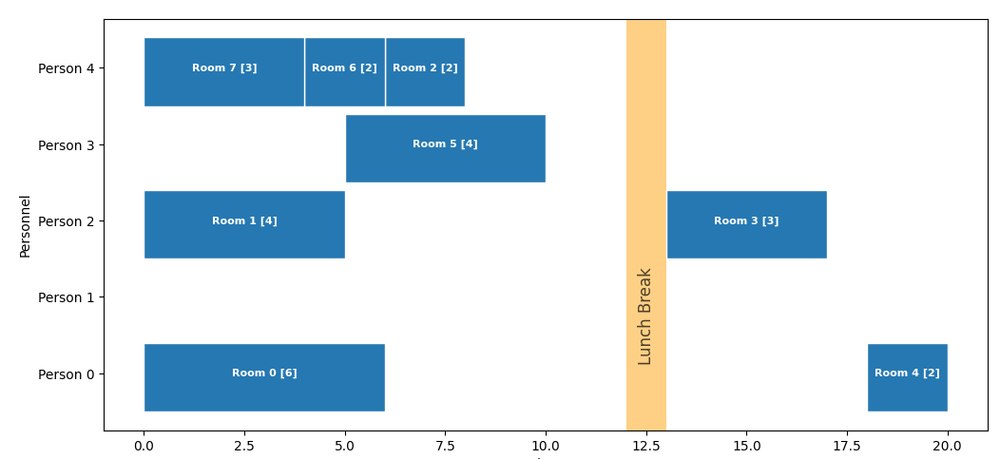

# Scheduling Solution based on OR Tools



This project is a scheduling solution based on OR Tools. It is a simple example of how to use OR Tools to solve a scheduling problem.
The use-case is similar to [the job shop problem (JSP)](https://en.wikipedia.org/wiki/Job-shop_scheduling) and is as follows:

- there are **locations** which have to be serviced by a team of workers. Each location has a type and a duration
- there are **workers** who have different **skills** and can work on different types of locations
- between servicing a location there is a variable **delay** 
- the schedule has to respect lunch breaks and the maximum working hours of the workers
- the objective function is to minimize the total time to service all locations.

📘 The book entitled ["A book on open shop scheduling"](https://www.amazon.com/Book-Open-Shop-Scheduling-International/dp/303091027X) by Wieslaw Kubiak provides a good introduction to the topic.

🐺 You can also find [a simplified approach using Wolfram](https://discovery.graphsandnetworks.com/diverse/wolfram-scheduling.html) on Orbifold's Journal.

<a href="https://colab.research.google.com/drive/1C1wnH-RyX4wJR77s0_cnaVJnVqFiCPep" target="_parent"></a>

## Installation

You can use a conda environment or a virtual environment to install the dependencies.
Make sure you have [Poetry](https://python-poetry.org/docs/) installed.

```bash
poetry install
```
If you already have a venv present, you can use it with poetry:

```bash
python -m venv venv && source venv/bin/activate
poetry config virtualenvs.in-project true
poetry install
```
## Testing

You can run the tests with the following command:

```bash
poetry run pytest
```
The tests are located in the `tests` folder and they also explain the use-case.

## Visualization

The Gantt-like viz based on Matplotlib is of interest on its own. That is, it's somewhat tricky to assemble it from scratch. There are very good packages out there doing a much better job but this one is easier to adapt.


## Feedback

- [Twitter](https://twitter.com/theorbifold) 
- [Email](mailto:info@orbifold.net)
- [Orbifold Consulting](https://GraphsAndNetworks.com)

## License

**MIT License**

_Copyright (c) Orbifold B.V._

Permission is hereby granted, free of charge, to any person obtaining a copy
of this software and associated documentation files (the "Software"), to deal
in the Software without restriction, including without limitation the rights
to use, copy, modify, merge, publish, distribute, sublicense, and/or sell
copies of the Software, and to permit persons to whom the Software is
furnished to do so, subject to the following conditions:

The above copyright notice and this permission notice shall be included in all
copies or substantial portions of the Software.

THE SOFTWARE IS PROVIDED "AS IS", WITHOUT WARRANTY OF ANY KIND, EXPRESS OR
IMPLIED, INCLUDING BUT NOT LIMITED TO THE WARRANTIES OF MERCHANTABILITY,
FITNESS FOR A PARTICULAR PURPOSE AND NONINFRINGEMENT. IN NO EVENT SHALL THE
AUTHORS OR COPYRIGHT HOLDERS BE LIABLE FOR ANY CLAIM, DAMAGES OR OTHER
LIABILITY, WHETHER IN AN ACTION OF CONTRACT, TORT OR OTHERWISE, ARISING FROM,
OUT OF OR IN CONNECTION WITH THE SOFTWARE OR THE USE OR OTHER DEALINGS IN THE
SOFTWARE.